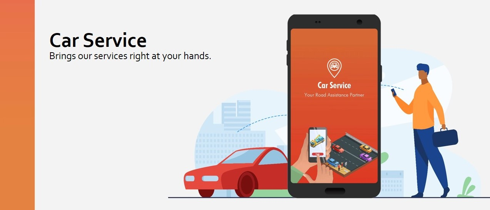
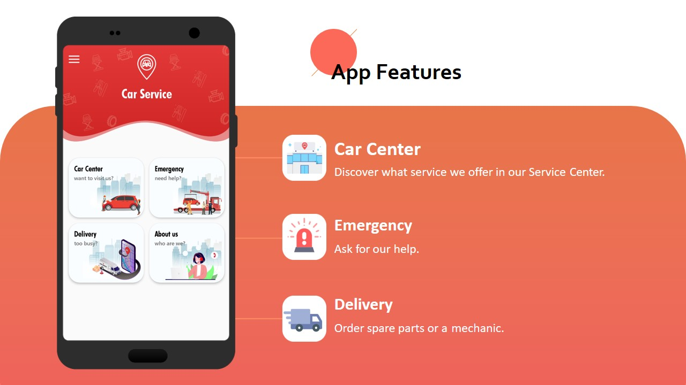
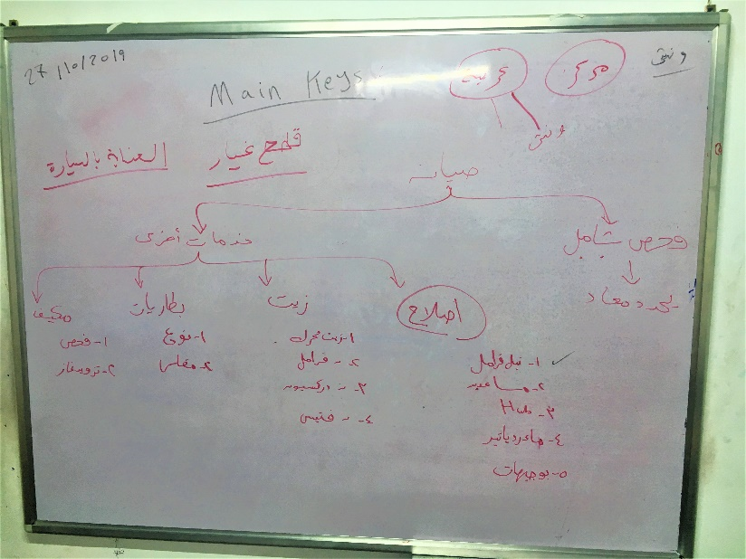
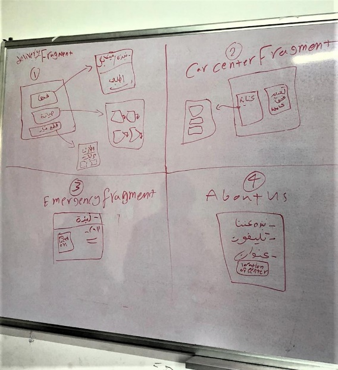
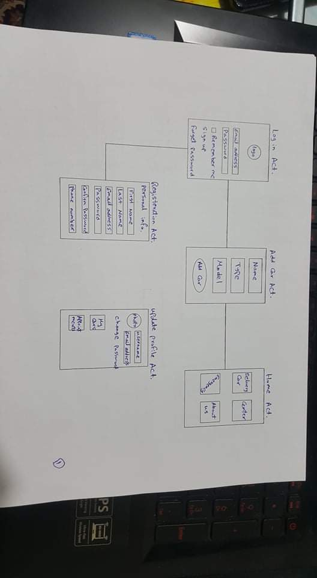
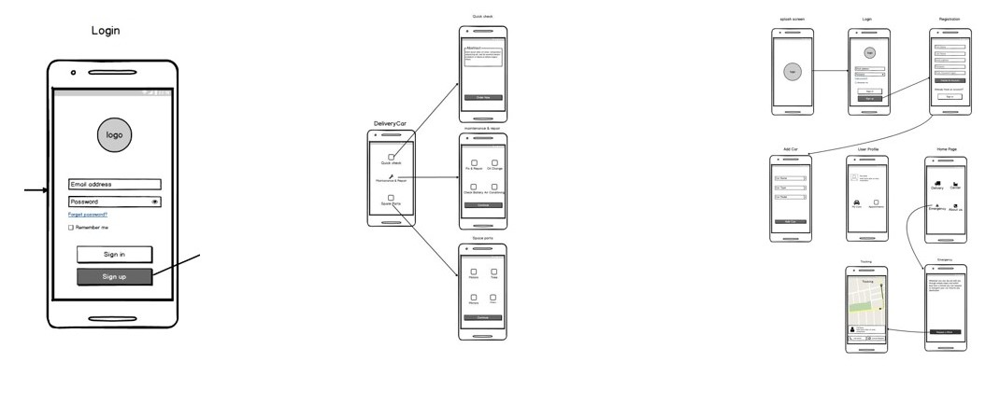
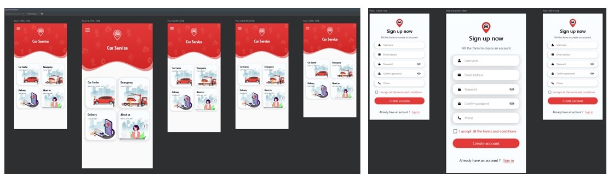

# Car Service Android Application [Graduation Project May 2020]

The app brings the customer all the service introduced by a “Car service shop”

## Tech-Stack

* Java Programming Language, Xml.
* Android Studio IDE.
* VCS: Github.
* Firebase Backend : Authentication, Realtime Database, Storage.
* Google Maps Api, Google Auth Api, Facebook Auth Api, Twitter Auth Api.
* Third-Party Libraries: SDP, Gson.
* For Design : Adobe XD, Adobe Illustrator. 

## Application Features

## Planning the Application

### First Meeting was held to:

* Discuss exactly what we wanted to create.
* How to do it.
* Divide ourselves into teams.

### Wireframe and Designing:

* Wireframe
  
* Prototyping the Design in Adobe XD
  

### Implementation:
 * Coding a Responsive Ui to Work on Most Screens.
 
 * Creating Custom Components.
 * Coding the Navigation between Activities and Fragments. 
 * Sending Requests to the Backend and Handling the Response.
 * Managing the Data Flow Throughout the Activities and Fragments.
 * Implementing Google's, facebook's,Twitter's sign in Api.

